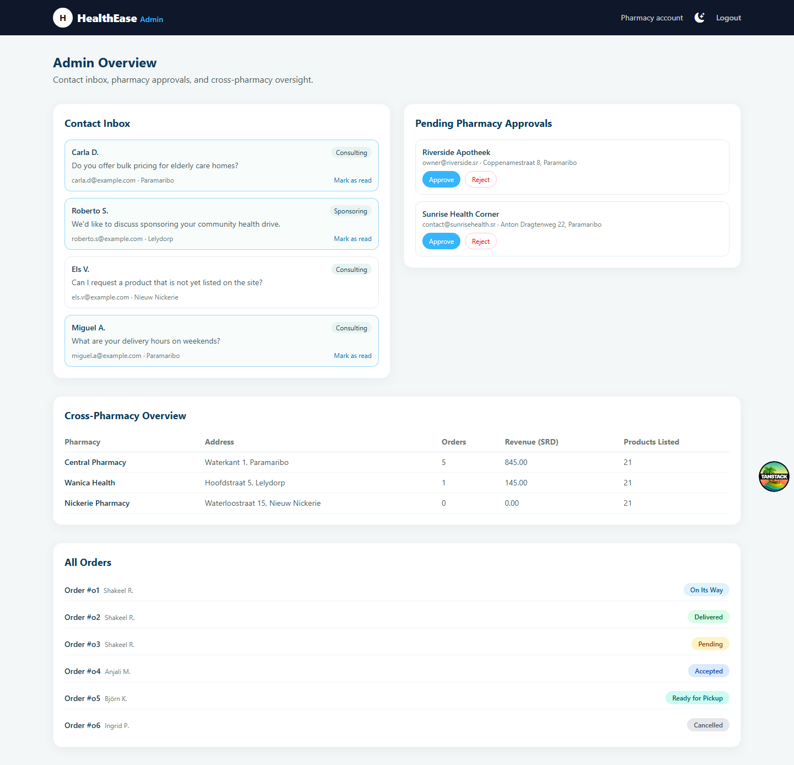
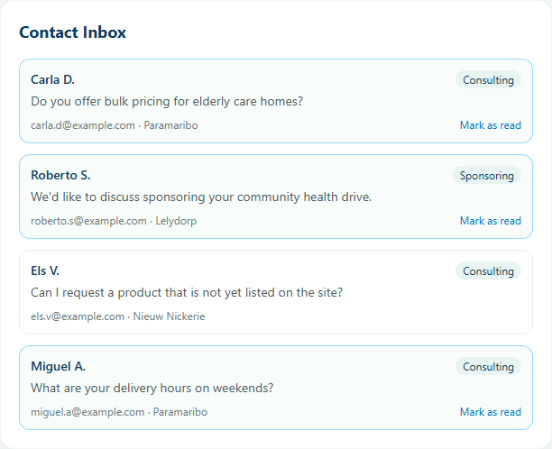
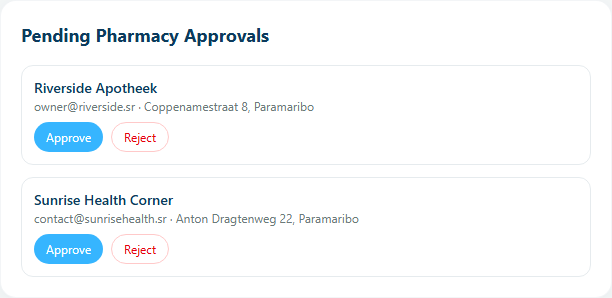

Dit deel is voor **admins**: het platformbrede beheeroverzicht van HealthEase (contactberichten, omzet per apotheek en alle bestellingen). Ben je klant of apotheekmedewerker, ga dan naar de [Handleiding-overzichtspagina](/handleiding/) voor het juiste deel.

## Inhoudsopgave

1. [Toegang tot het Admin-overzicht](#1-toegang-tot-het-admin-overzicht)
2. [Indeling van de pagina](#2-indeling-van-de-pagina)
3. [Contact Inbox](#3-contact-inbox)
4. [Pending Pharmacy Approvals](#4-pending-pharmacy-approvals)
5. [Cross-Pharmacy Overview](#5-cross-pharmacy-overview)
6. [All Orders](#6-all-orders)

---

## 1. Toegang tot het Admin-overzicht

Log in via **Login** met je e-mail, wachtwoord en Account type **Admin** (dezelfde inlogpagina als klanten en apotheken gebruiken). Je wordt automatisch doorgestuurd naar **/admin**.

:::danger
Op het registratieformulier (**/register**) is **Admin** momenteel gewoon een van de opties in de Account type-keuzelijst, naast Customer en Pharmacy — er is geen aparte goedkeuring of controle die dit tegenhoudt. In de praktijk kan dus elke bezoeker zichzelf een admin-account aanmaken. Dit is een beveiligingsprobleem, geen bedoeld gedrag; meld dit met voorrang aan het ontwikkelteam zodat het toekennen van de ADMIN-rol serverside wordt afgeschermd (bijvoorbeeld alleen door een bestaande admin, of via directe databasetoegang).
:::

## 2. Indeling van de pagina

De Admin-pagina heeft een eigen, donkere navigatiebalk ("HealthEase Admin") met alleen een thema-schakelaar en **Logout** — er is geen zoekbalk of actieknop zoals bij het apotheekdashboard.

Daaronder staan vier kaarten. Bovenaan staan **Contact Inbox** en **Pending Pharmacy Approvals** naast elkaar (op mobiel onder elkaar), en daaronder — over de volle breedte — **Cross-Pharmacy Overview** en **All Orders**:

1. **Contact Inbox** — inkomende contactberichten (hoofdstuk 3).
2. **Pending Pharmacy Approvals** — openstaande apotheek-aanmeldingen om goed te keuren of af te wijzen (hoofdstuk 4).
3. **Cross-Pharmacy Overview** — een tabel met kerncijfers per apotheek (hoofdstuk 5).
4. **All Orders** — alle bestellingen van alle apotheken samen, alleen ter inzage (hoofdstuk 6).

Er zijn geen tabbladen of extra filters op deze pagina: alles staat in één lange, doorscrollbare pagina.

## 3. Contact Inbox

Elk bericht dat een bezoeker via de **Contact**-pagina van de website verstuurt (zowel "Consulting" als "Sponsoring") komt hier binnen. Per bericht zie je:

- De naam van de afzender en een badge met het berichttype (**Consulting** / **Sponsoring**).
- De berichttekst.
- E-mailadres en opgegeven locatie.

Nieuwe, ongelezen berichten hebben een blauwe rand en een lichte achtergrondkleur, en tonen een link **"Mark as read"**. Klik daarop om het bericht als gelezen te markeren; de rand en de knop verdwijnen dan.

Er is geen manier om vanuit dit scherm te antwoorden — gebruik het opgegeven e-mailadres om zelf te reageren.

:::note
Deze kaart toont momenteel een vaste, voorbeeldset berichten en is nog niet gekoppeld aan de berichten die bezoekers echt via het Contact-formulier versturen (die worden wel opgeslagen, maar nog niet hier getoond). Meld dit aan het ontwikkelteam.
:::

## 4. Pending Pharmacy Approvals

Naast Contact Inbox staat de kaart **Pending Pharmacy Approvals** met openstaande aanmeldingen van nieuwe apotheken. Per aanmelding zie je de naam van de apotheek, het e-mailadres van de eigenaar en het adres, met twee knoppen:

- **Approve** — keurt de aanmelding goed en verwijdert deze uit de lijst.
- **Reject** — wijst de aanmelding af en verwijdert deze eveneens uit de lijst.

Beide acties gebeuren direct, zonder extra bevestigingsvraag, en tonen een korte bevestiging onderaan het scherm. Is er niets openstaand, dan toont de kaart "No pending applications."

:::note
Deze kaart werkt momenteel nog met een vaste, losstaande lijst van voorbeeldaanmeldingen — ze is nog niet gekoppeld aan echte apotheekregistraties via het registratieformulier. Een nieuw apotheekaccount (zie de [handleiding voor apotheekmedewerkers](/handleiding/apotheek/)) is direct actief en verschijnt dus niet automatisch in deze lijst.
:::

## 5. Cross-Pharmacy Overview

Deze tabel geeft in één oogopslag de status van elke aangesloten apotheek, met de kolommen:

- **Pharmacy** — naam van de apotheek.
- **Address** — adres.
- **Orders** — totaal aantal geplaatste bestellingen bij die apotheek (ongeacht status).
- **Revenue (SRD)** — totale omzet van die apotheek.
- **Products Listed** — aantal producten dat die apotheek momenteel op voorraad heeft.

Dit overzicht is alleen-lezen: er zijn geen knoppen om apotheekgegevens hier aan te passen.

## 6. All Orders

Een platte lijst van alle bestellingen van alle apotheken samen, met per regel het bestelnummer, de klantnaam en een statusbadge (dezelfde kleuren/labels als in het apotheekdashboard: Pending, Accepted, Ready for Delivery, Ready for Pickup, On Its Way, Delivered, Cancelled). In tegenstelling tot het apotheekdashboard staan hier **geen actieknoppen** (geen statusknoppen, geen Cancel, geen Details) — dit scherm is puur ter controle en oversight, niet om bestellingen te verwerken. Het verwerken van een bestelling gebeurt door de betreffende apotheek zelf (zie de [handleiding voor apotheekmedewerkers](/handleiding/apotheek/)).

## Hulp nodig?

Deze handleiding beschrijft alleen wat er op het Admin-scherm te zien is. Voor vragen over het toekennen van admin-rechten of databasebeheer, neem contact op met wie het HealthEase-platform technisch beheert.
