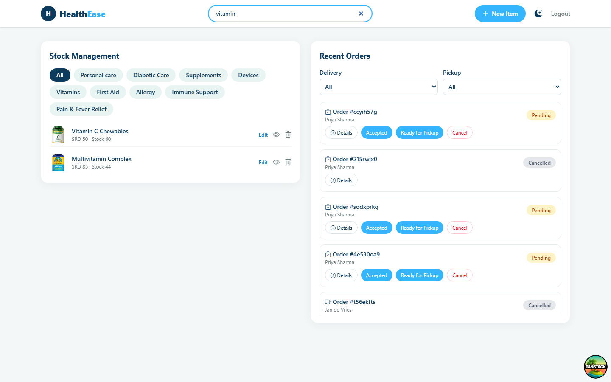
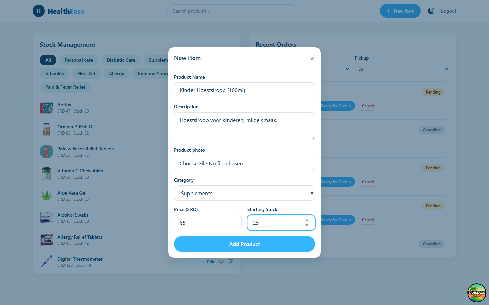
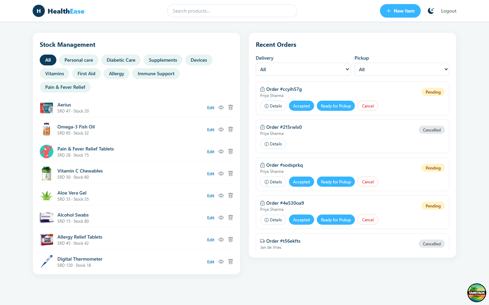
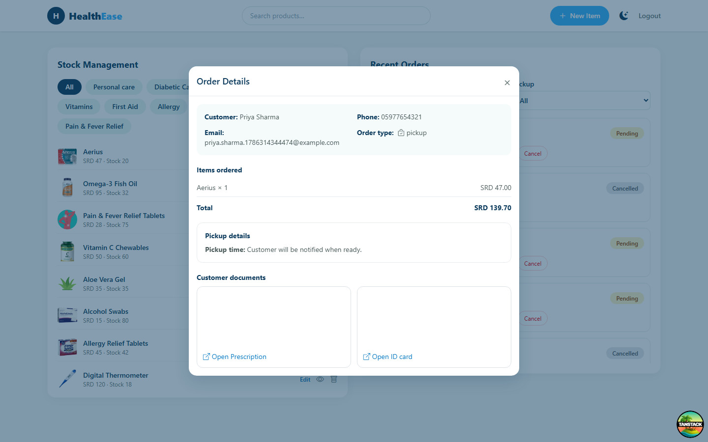

Dit deel is voor **apotheekmedewerkers**: hoe je via het Pharmacy Dashboard de voorraad van je apotheek beheert en binnenkomende bestellingen verwerkt. Ben je klant of admin, ga dan naar de [Handleiding-overzichtspagina](/handleiding/) voor het juiste deel.

## Inhoudsopgave

1. [Registreren als apotheek](#1-registreren-als-apotheek)
2. [Het Pharmacy Dashboard](#2-het-pharmacy-dashboard)
   - [2.1 Indeling van het dashboard](#21-indeling-van-het-dashboard)
   - [2.2 Navigatiebalk van het dashboard](#22-navigatiebalk-van-het-dashboard)
3. [Voorraadbeheer](#3-voorraadbeheer)
   - [3.1 Product opzoeken](#31-product-opzoeken)
   - [3.2 Productgegevens bekijken en bewerken](#32-productgegevens-bekijken-en-bewerken)
   - [3.3 Nieuw product toevoegen](#33-nieuw-product-toevoegen)
   - [3.4 Product verwijderen](#34-product-verwijderen)
4. [Bestellingen beheren](#4-bestellingen-beheren)
   - [4.1 Bestellingskaarten lezen](#41-bestellingskaarten-lezen)
   - [4.2 Een bestelling verwerken](#42-een-bestelling-verwerken)
   - [4.3 Een bestelling annuleren](#43-een-bestelling-annuleren)
   - [4.4 Geannuleerd](#44-geannuleerd)

---

## 1. Registreren als apotheek

Er is geen apart registratieformulier voor apotheken: ga naar de gewone registratiepagina (**Register**, `/register`) en vul het formulier "Create an account" in:

- **Full name**, **Email**, **Password** — dit wordt meteen je inlogaccount.
- **Account type** — kies hier **Pharmacy** in plaats van Customer.

Klik op **Create account**. Er wordt bij registratie geen apotheeknaam, adres of locatie opgevraagd — die gegevens komen later aan bod. Er is ook geen goedkeuringsstap: je account is direct actief en je komt meteen op je dashboard (**/pharmacy/dashboard**) terecht. (Het Admin-scherm toont wel een kaart "Pending Pharmacy Approvals" met Approve/Reject-knoppen — zie de [handleiding voor admins](/handleiding/admin/) — maar dit blokkeert momenteel niet het inloggen of gebruiken van je apotheekaccount.)

## 2. Het Pharmacy Dashboard

Log in met je apotheekaccount — je wordt automatisch naar **/pharmacy/dashboard** gestuurd.

### 2.1 Indeling van het dashboard

Het dashboard bestaat uit één scherm met twee kaarten naast elkaar (op mobiel onder elkaar):

- Links: **Stock Management** — voorraadbeheer (zie hoofdstuk 3).
- Rechts: **Recent Orders** — bestellingen beheren (zie hoofdstuk 4).

Er zijn geen aparte tabbladen: alles is in één oogopslag zichtbaar.

### 2.2 Navigatiebalk van het dashboard

Bovenaan het dashboard vind je:

- Het HealthEase-logo (brengt je terug naar de openbare website).
- Een zoekbalk **"Search products…"** die direct de productlijst in Stock Management filtert op naam.
- De knop **"+ New Item"** om een nieuw product toe te voegen (zie 3.3).
- De thema-schakelaar (licht/donker).
- **Logout** om uit te loggen.

## 3. Voorraadbeheer

### 3.1 Product opzoeken

In de kaart **Stock Management** staan bovenaan categorie-knoppen; klik op een categorie om alleen de producten daarvan te tonen. Combineer dit desgewenst met de zoekbalk bovenaan het dashboard (zie 2.2) om snel een specifiek product te vinden.

### 3.2 Productgegevens bekijken en bewerken

Elk product in de lijst toont een miniatuurafbeelding, naam, prijs en de huidige voorraad (bijv. "SRD 45 · Stock 42"). Ernaast staan drie acties:

- **Edit** — verandert de rij in een inline formulier met **Name**, **Price**, **Description**, **Category** (keuzelijst), **Quantity** en een optionele nieuwe productfoto; klik op **Done** om op te slaan of **Cancel** om te annuleren.
- Het oog-icoon — opent een alleen-lezen venster **"Product Details"** met afbeelding, naam, prijs, beschrijving en voorraad.
- Het prullenbak-icoon — verwijdert het product (zie 3.4).

Via **Edit** kun je dus niet alleen de voorraadhoeveelheid aanpassen, maar ook naam, prijs, categorie, beschrijving en foto van het product.

### 3.3 Nieuw product toevoegen

Klik op **"+ New Item"** in de navigatiebalk om het venster **"New Item"** te openen. Vul in:

- **Product Name**
- **Description**
- **Product photo** — optioneel; upload je geen foto, dan krijgt het product een standaard placeholder-afbeelding
- **Category** (keuzelijst)
- **Price (SRD)**
- **Starting Stock** — de beginvoorraad voor jouw apotheek

Klik op **Add Product** om te bevestigen.

### 3.4 Product verwijderen

Klik op het prullenbak-icoon naast een product om het te verwijderen. Er verschijnt geen bevestigingsvraag — de actie is direct. Elk product hoort bij precies één apotheek, dus dit verwijdert het product (en de bijbehorende voorraad) volledig — er is geen gedeelde productcatalogus waar het product bij andere apotheken zou blijven staan.

## 4. Bestellingen beheren

### 4.1 Bestellingskaarten lezen

In de kaart **Recent Orders** zie je per bestelling: een icoon voor bezorging of afhalen, het bestelnummer ("Order #…") en de naam van de klant, met rechtsboven een gekleurde statusbadge (bijv. geel voor Pending, blauw voor Accepted, grijs voor Cancelled). Boven de lijst staan twee onafhankelijke filters:

- **Delivery** — All, Pending, Ready for delivery, On its way (filtert alleen bezorgbestellingen)
- **Pickup** — All, Pending, Ready for pickup (filtert alleen afhaalbestellingen)

Per bestelling is er één knop **Details**, die het venster **"Order Details"** opent met klantgegevens (naam, telefoon, e-mail, type bestelling), de bestelde producten met totaalbedrag, de bezorg- of afhaalgegevens (bij bezorging: adres, afstand en een link naar Google Maps; bij afhalen: het afhaaltijdstip) en de geüploade klantdocumenten (recept en ID-kaart).

Daarnaast verschijnt per bestelling een aparte knop voor elke status die je nog kunt instellen (bijvoorbeeld **Accepted**, **Ready for Delivery**, **On Its Way**), plus — zolang de bestelling nog niet **Delivered** of **Cancelled** is — een rode knop **Cancel**.

### 4.2 Een bestelling verwerken

Klik op de knop met de gewenste status om de bestelling daarnaar te zetten. Voor bezorgbestellingen zijn dat **Accepted**, **Ready for Delivery** en **On Its Way**; voor afhaalbestellingen **Accepted** en **Ready for Pickup**. Er is geen vaste volgorde verplicht — je kunt bijvoorbeeld direct van **Pending** naar **On Its Way** springen.

:::note
Er is momenteel geen knop om een bestelling als **Delivered** te markeren — een bezorg- of afhaalbestelling blijft na "On Its Way" / "Ready for Pickup" in die status staan. Dit lijkt een ontbrekende functie in de huidige versie van het dashboard; meld dit aan het ontwikkelteam als je hier tegenaan loopt.
:::

### 4.3 Een bestelling annuleren

Klik op **Cancel** naast een bestelling om deze te annuleren, zolang de status nog niet Delivered of Cancelled is. Ook dit gebeurt direct, zonder bevestigingsvraag.

### 4.4 Geannuleerd

Er is geen apart scherm voor geannuleerde bestellingen: een geannuleerde bestelling blijft gewoon in de lijst **Recent Orders** staan, herkenbaar aan de grijze badge **"Cancelled"**, en zonder statusknoppen (alleen **Details** blijft zichtbaar). Omdat de filters geen aparte optie voor "Cancelled" (of "Accepted") hebben, zie je geannuleerde bestellingen alleen terug wanneer het bijbehorende filter (Delivery of Pickup) op **All** staat.

## Hulp nodig?

Kijk op de **FAQ**-pagina op de openbare website (link "How does a pharmacy get certified to join HealthEase?" voor apotheek-gerelateerde vragen), of gebruik de **Contact**-pagina om rechtstreeks een bericht te sturen naar het HealthEase-team.
