Dit deel is voor **klanten**: hoe je een account aanmaakt, producten zoekt en koopt, en je bestellingen opvolgt. Ben je apotheekmedewerker of admin, ga dan naar de [Handleiding-overzichtspagina](/handleiding/) voor het juiste deel.

## Inhoudsopgave

1. [Account aanmaken en inloggen](#1-account-aanmaken-en-inloggen)
   - [1.1 Een nieuw account aanmaken (Sign Up)](#11-een-nieuw-account-aanmaken-sign-up)
   - [1.2 Inloggen](#12-inloggen)
2. [De homepage](#2-de-homepage)
   - [2.1 De navigatiebalk](#21-de-navigatiebalk)
   - [2.2 Het navigatiemenu](#22-het-navigatiemenu)
   - [2.3 Hero sectie en categorieën](#23-hero-sectie-en-categorieen)
3. [Winkelen en producten zoeken](#3-winkelen-en-producten-zoeken)
   - [3.1 Categorieën](#31-categorieen)
   - [3.2 Een product toevoegen aan de winkelwagen](#32-een-product-toevoegen-aan-de-winkelwagen)
4. [Een bestelling plaatsen](#4-een-bestelling-plaatsen)
   - [4.1 Checkout Details](#41-checkout-details)
5. [Bestelstatus volgen en review plaatsen](#5-bestelstatus-volgen-en-review-plaatsen)
   - [5.1 Mijn Bestellingen](#51-mijn-bestellingen)
   - [5.2 Deel je ervaring](#52-deel-je-ervaring)
   - [5.3 Meldingen (Notifications)](#53-meldingen-notifications)
6. [Contact opnemen](#6-contact-opnemen)
7. [Algemene voorwaarden](#7-algemene-voorwaarden)

---

## 1. Account aanmaken en inloggen

### 1.1 Een nieuw account aanmaken (Sign Up)

Ga naar de registratiepagina (**Register**). Het formulier "Create an account" vraagt om:

- **Full name** – je volledige naam
- **Email** – je e-mailadres (dit wordt ook je inlognaam)
- **Password** – een wachtwoord
- **Account type** – een keuzelijst met **Customer**, **Pharmacy** en **Admin**; laat dit op **Customer** staan als gewone klant

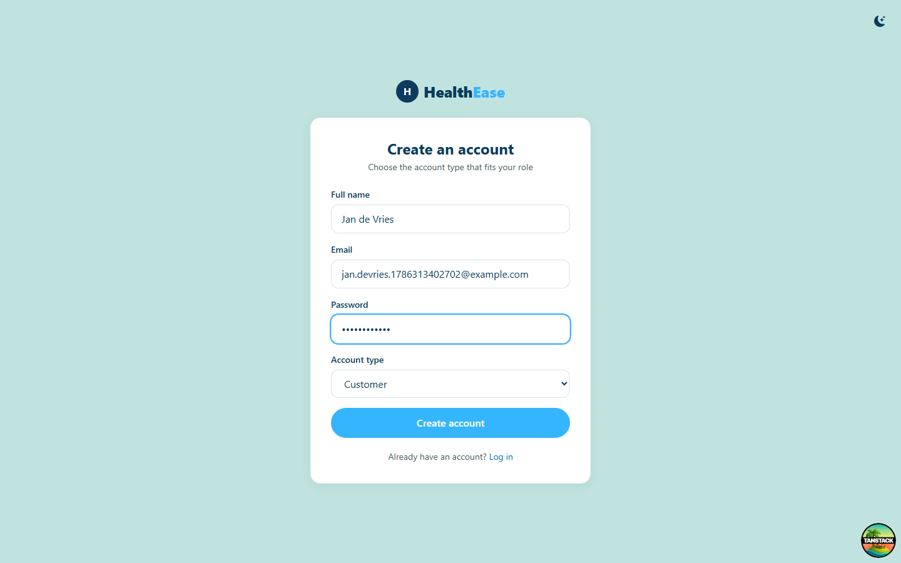

Klik op **Create account** om het account aan te maken. Er is geen apart bevestigingswachtwoord en geen aparte e-mailverificatiestap: zodra het account is aangemaakt, ben je meteen ingelogd. Kies je bij Account type voor **Customer**, dan kom je op je accountpagina (**/account**) terecht — kies je **Pharmacy** of **Admin**, dan ga je meteen naar het bijbehorende dashboard (zie de handleiding voor [apotheekmedewerkers](/handleiding/apotheek/) of [admins](/handleiding/admin/)).

### 1.2 Inloggen

Heb je al een account, ga dan naar **Login**. Vul **Email** en **Password** in, kies bij **Account type** dezelfde rol als waarmee je hebt geregistreerd (**Customer**, **Pharmacy** of **Admin**) en klik op **Log In**.

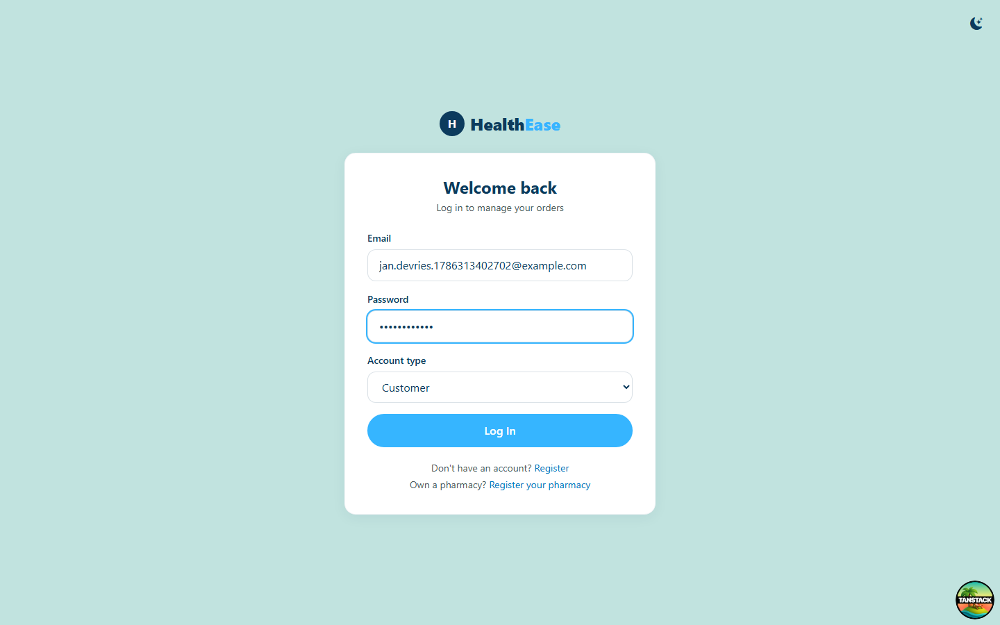

Klopt de gekozen rol niet met de rol van je account, dan verschijnt de melding "This account does not have the selected role" en word je niet ingelogd — kies dan het juiste Account type. Na een geslaagde login word je automatisch naar de juiste plek gestuurd: klanten komen op de accountpagina (**/account**) terecht.

## 2. De homepage

### 2.1 De navigatiebalk

Bovenaan elke pagina staat de navigatiebalk met:

- Het HealthEase-logo (linksboven) — brengt je terug naar de homepage.
- De hoofdmenu-items: **Home**, **Shop**, **Essentials**, **Contact**.
- De knop **Locations**, die een overzicht van alle aangesloten apotheken in Suriname opent (zie hieronder).
- Het winkelwagen-icoontje — hierop klikken brengt je direct naar de checkout-pagina; zolang je winkelwagen niet leeg is, zie je een klein getal (badge) met het aantal producten.
- Het accountpictogram — brengt je naar de inlogpagina.
- Een schakelaar voor licht/donker thema.

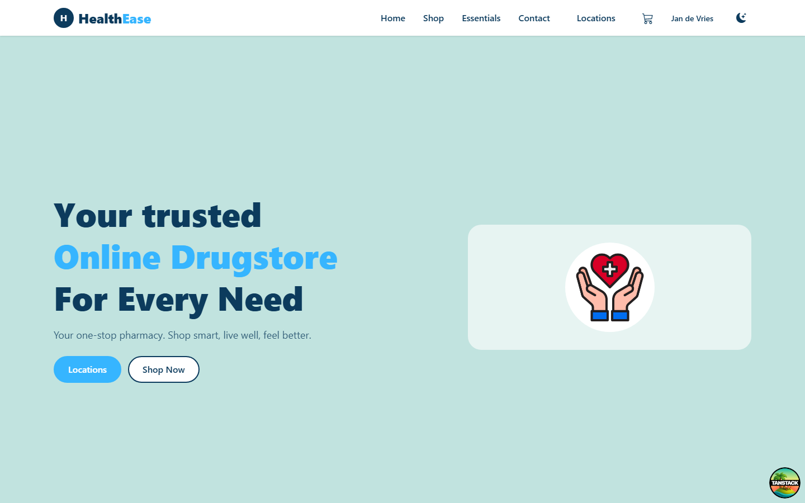

### 2.2 Het navigatiemenu

Op een smal (mobiel) scherm worden de menu-items vervangen door een hamburger-icoon rechtsboven. Tik erop om een volledig scherm te openen met dezelfde links (**Home**, **Shop**, **Essentials**, **Contact**), plus **"Login / Register"**, de knop **Locations** en de thema-schakelaar.

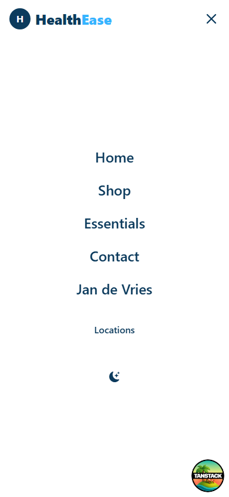

Via de knop **Locations** (zowel op desktop als mobiel) open je een overzicht "Apotheken in Suriname" met per apotheek de naam, het adres, telefoonnummer (indien bekend) en een knop **"Get Directions"** die de locatie in Google Maps opent.

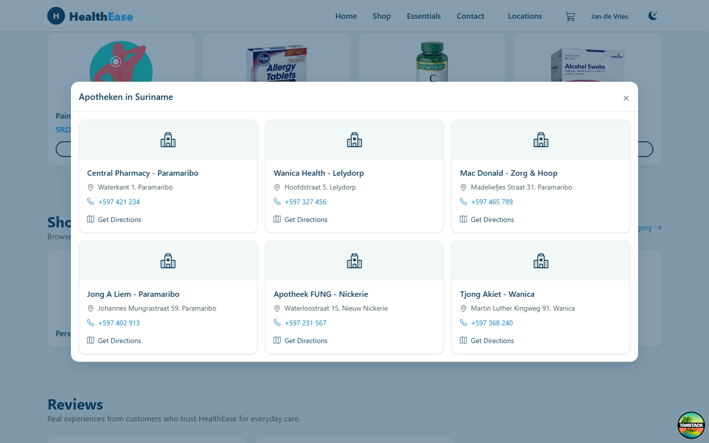

### 2.3 Hero sectie en categorieën

De homepage begint met een introductiebanner ("Your trusted Online Drugstore For Every Need") met de knoppen **Shop Now** en **Locations**. Daaronder staan drie secties:

- **"Everyday Must-Haves"** — een selectie van vier uitgelichte producten, met een link **"View All"** naar de Essentials-pagina.
- **"Shop by Category"** — de eerste vier productcategorieën als tegels; hierop klikken opent de Shop-pagina gefilterd op die categorie.
- **"Reviews"** — klantervaringen die via **"Share Your Experience"** op de accountpagina zijn achtergelaten (zie 5.2).

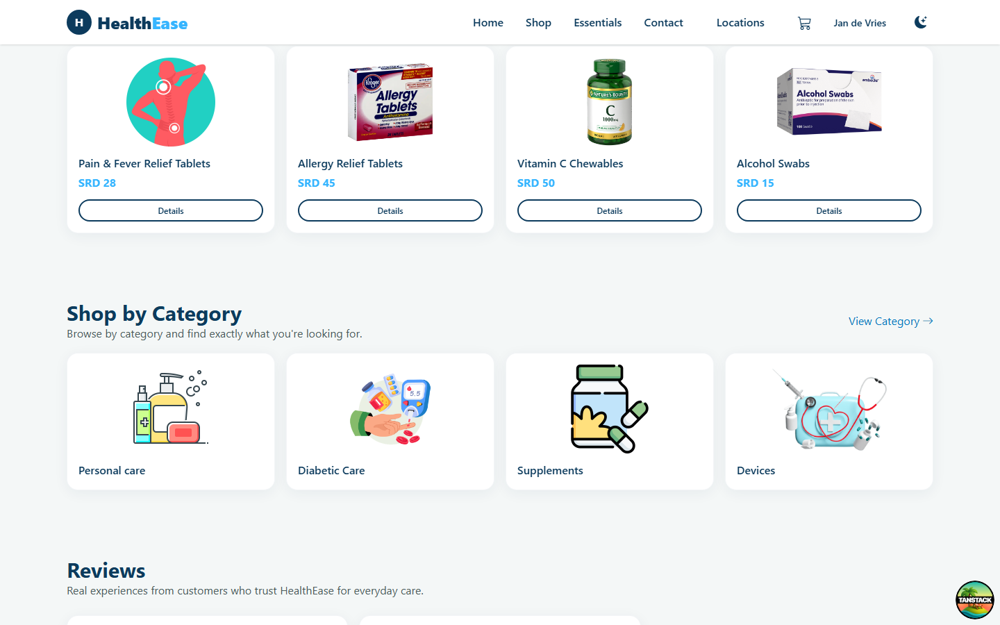

## 3. Winkelen en producten zoeken

### 3.1 Categorieën

Ga naar **Shop** om alle producten te doorzoeken. Bovenaan staat een rij categorie-knoppen (o.a. Personal care, Diabetic Care, Supplements, Devices, Vitamins, First Aid, Allergy, Pain & Fever Relief, Immune Support) plus een knop **All**. Klik op een categorie om alleen de producten uit die categorie te tonen; de actieve categorie wordt donkerblauw gemarkeerd.

Daaronder staat een zoekbalk ("Search products…") waarmee je direct op productnaam kunt filteren, bovenop het categoriefilter. Het aantal resultaten wordt live getoond.

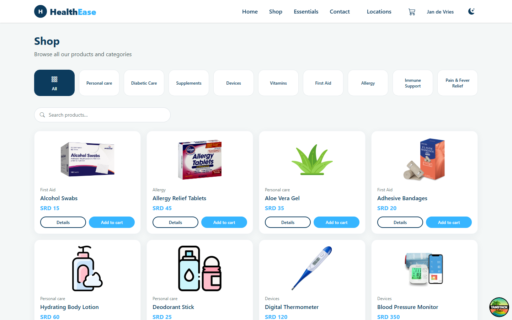

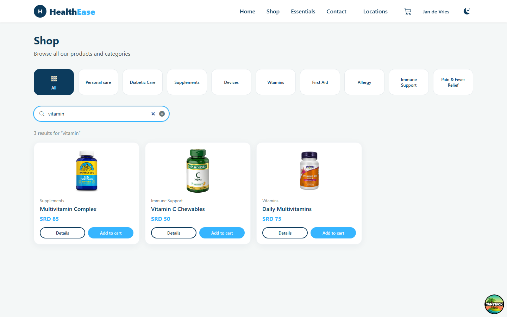

### 3.2 Een product toevoegen aan de winkelwagen

Elk product wordt getoond als een kaart met afbeelding, categorie, naam, prijs (in SRD) en twee knoppen:

- **Details** — opent een eigen productpagina met een grotere afbeelding, de beschrijving, prijs en extra informatie (**Ingredients**, **Dosage**, **How to use**, **Commonly used for**), plus de knoppen **Add to cart** en **Go to checkout**. Onderaan de pagina staat een **Reviews**-sectie met reviews voor dit specifieke product, en — ben je ingelogd — een formulier **"Leave a review"** om zelf zo'n productreview achter te laten (met sterrenbeoordeling en tekst). Dit is een andere, losstaande review dan de algemene ervaringsreview die je op je accountpagina achterlaat (zie 5.2). Er staat ook een knop **Share product**, die de link naar het product naar je klembord kopieert.
- **Add to cart** — voegt het product direct vanaf de kaart toe aan je winkelwagen, zonder naar de productpagina te gaan.

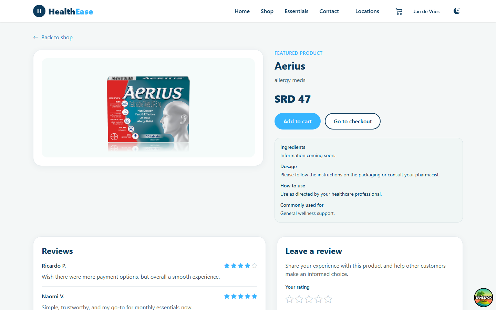

Na het toevoegen verschijnt kort een melding onderaan het scherm ("… added to cart") en loopt het getal op het winkelwagen-icoon in de navigatiebalk op. Voeg je hetzelfde product nogmaals toe, dan wordt het aantal in de winkelwagen verhoogd in plaats van dat er een tweede regel bijkomt.

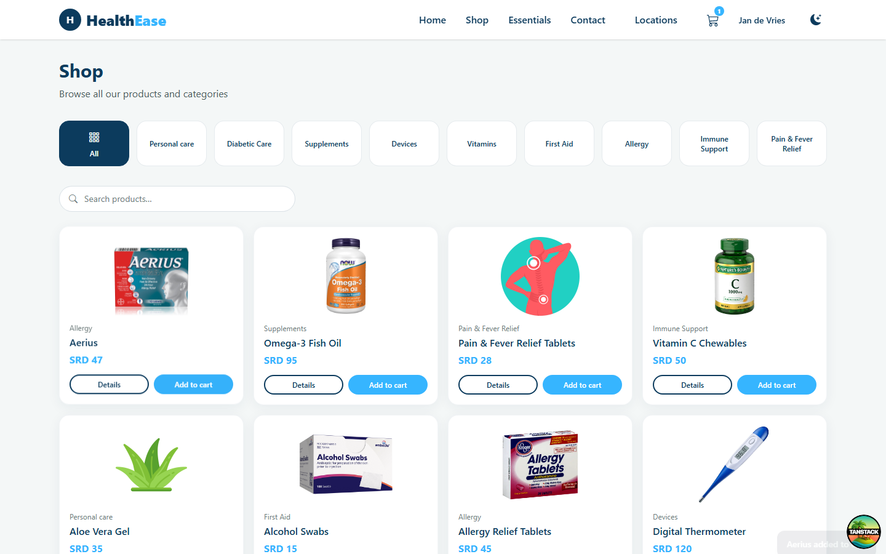

Er is geen apart winkelwagen-uitklapvenster: je winkelwagen bekijk je en bewerk je op de checkout-pagina (zie hoofdstuk 4), die je bereikt door op het winkelwagen-icoon te klikken.

## 4. Een bestelling plaatsen

Klik op het winkelwagen-icoon om naar **Checkout** te gaan. Let op: hiervoor moet je ingelogd zijn — ben je dat niet, dan word je eerst naar de inlogpagina gestuurd.

De checkout-pagina bestaat uit twee kolommen:

- **Links – Order Summary**: dit is tegelijk je winkelwagen. Per product zie je de afbeelding, naam, prijs per stuk, een invoerveld om het aantal aan te passen en een prullenbak-icoon om het product te verwijderen. Onderaan staat de kostenopbouw: **Bag Total**, **Admin Fee** (vast bedrag), **Platform Fee** (vast bedrag), eventueel **Delivery Fee**, **VAT (10%)**, en het **Total**.
- **Rechts – Checkout Details**: het bestelformulier (zie 4.1).

### 4.1 Checkout Details

Het formulier begint met het blok **"Contact information"**:

- **Prescription (image or PDF)** en **ID Card (image or PDF)** — verplichte upload van je recept en identiteitsbewijs
- **Full Name**, **Email**, **Phone**
- **Pharmacy** — een keuzelijst met alle aangesloten apotheken

Daaronder kies je bij **"Order type"** tussen **Pickup** en **Delivery**.

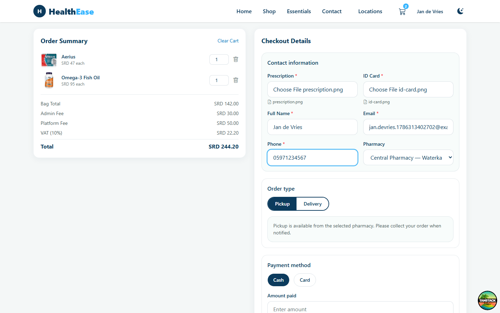

Bij **Pickup** zie je alleen een korte toelichting dat je de bestelling bij de gekozen apotheek ophaalt. Kies je **Delivery**, dan verschijnen extra velden:

- **Billing address**
- Een vinkje **"Same as billing address"** (standaard aangevinkt)
- **Delivery address** — alleen te wijzigen als "Same as billing address" uit staat
- Een vinkje **"Use my exact location"**, dat direct je locatie opvraagt zodra je het aanvinkt
- Een kaartvoorbeeld van de apotheek- of klantlocatie
- De knop **Use My Location**, die (ook los van het vinkje hierboven) via je browser je locatie opvraagt en de afstand tot de gekozen apotheek berekent (bijv. "≈ 3.1km away"). Bezorgen is alleen mogelijk tot **15 km** van de apotheek; is de afstand groter, dan verschijnt een foutmelding en kun je niet bestellen totdat je een dichterbij gelegen apotheek kiest.
- **Delivery notes** — optioneel opmerkingenveld (bijv. waar te parkeren)

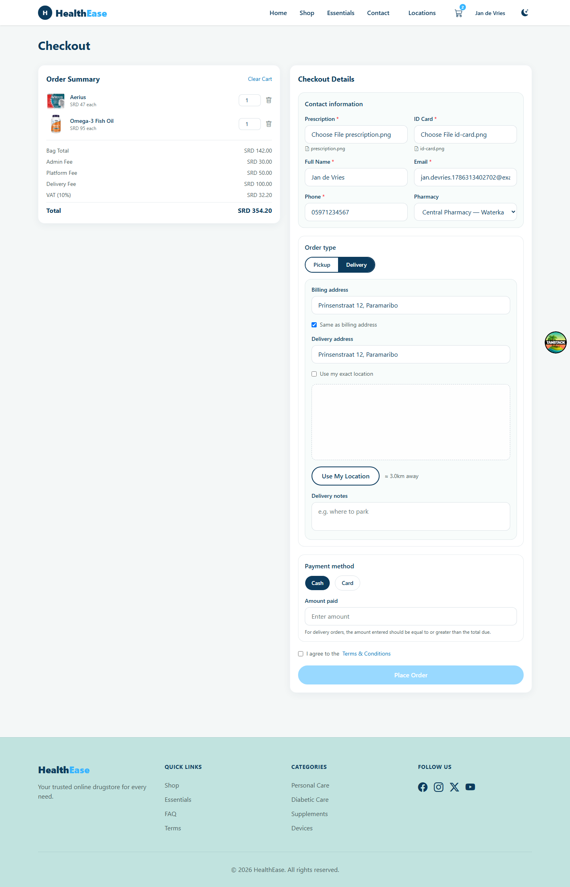

Vervolgens kies je bij **"Payment method"** tussen **Cash** en **Card**:

- **Cash** toont een veld **"Amount paid"**, dat minstens het totaalbedrag (Total) moet zijn.
- **Card** toont alleen een melding dat de kaartbetaling na het bevestigen van de bestelling wordt afgehandeld.

Vink tot slot het vakje **"I agree to the Terms & Conditions"** aan (zie hoofdstuk 7) en klik op **Place Order**. Deze knop blijft uitgeschakeld totdat alle verplichte velden correct zijn ingevuld.

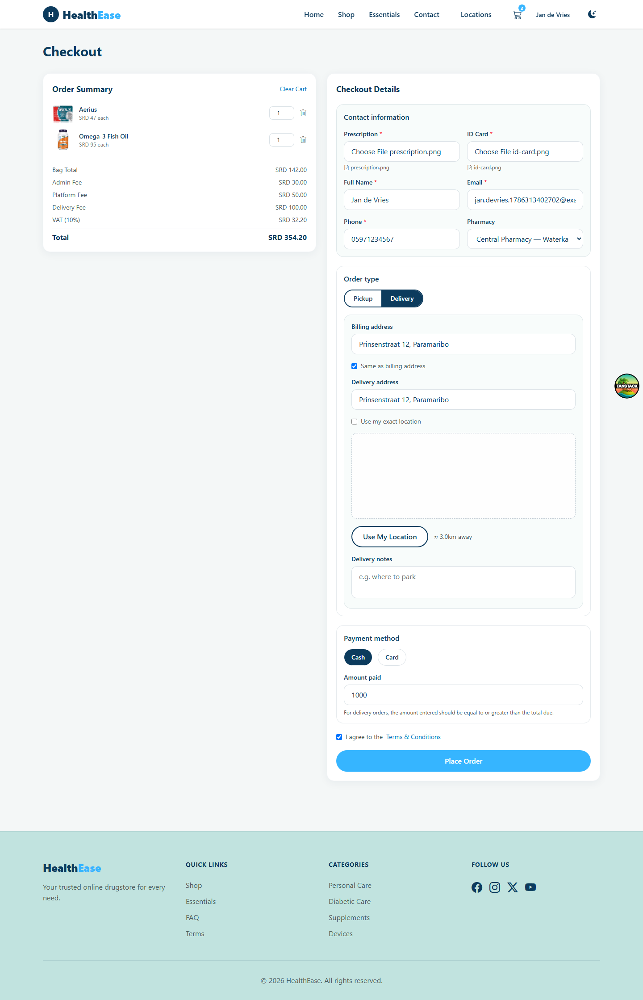

Na het plaatsen van de bestelling verschijnt een bevestigingsscherm ("Order placed successfully!") met de knoppen **"Continue shopping"** en **"View My Orders"**.

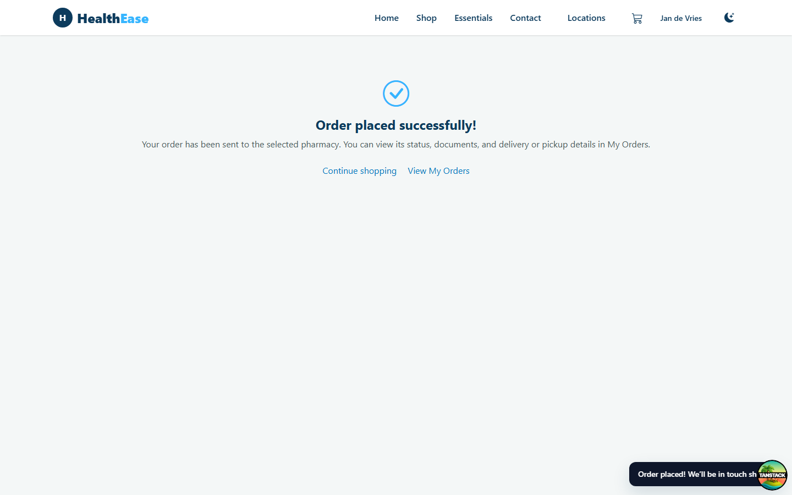

## 5. Bestelstatus volgen en review plaatsen

Ga naar je accountpagina (via **"View my orders"** na een bestelling, of via het accountpictogram nadat je bent ingelogd) om je bestellingen te bekijken en een review achter te laten.

### 5.1 Mijn Bestellingen

Onder **"My Orders"** zie je al je bestellingen als kaarten met bestelnummer, datum, afleverwijze (Pickup/Delivery) en de huidige status. Klik op een bestelling om deze uit te klappen en de productregels en het totaalbedrag te zien.

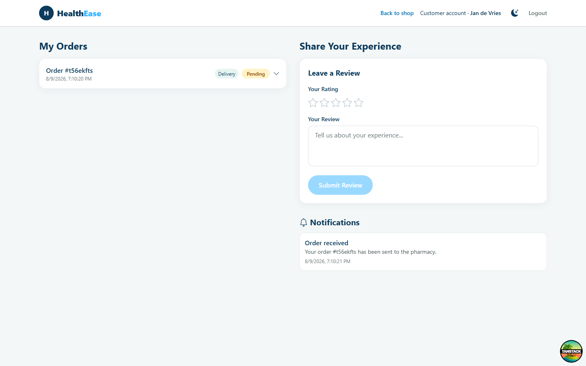

De mogelijke statussen zijn: **Pending**, **Accepted**, **Ready for Delivery** (bij bezorging) of **Ready for Pickup** (bij afhalen), **On Its Way** en **Delivered**, plus **Cancelled**. Deze worden door de apotheek bijgewerkt — als klant kun je de status alleen volgen, niet zelf wijzigen.

Zolang een bestelling nog **Pending** is, zie je bij het uitgeklapte order de knop **Cancel Order**. Hiermee annuleer je de bestelling zelf, direct en zonder extra bevestigingsstap. Zodra de apotheek de bestelling heeft geaccepteerd (status **Accepted** of later), kun je deze niet meer zelf annuleren — neem dan contact op met de apotheek.

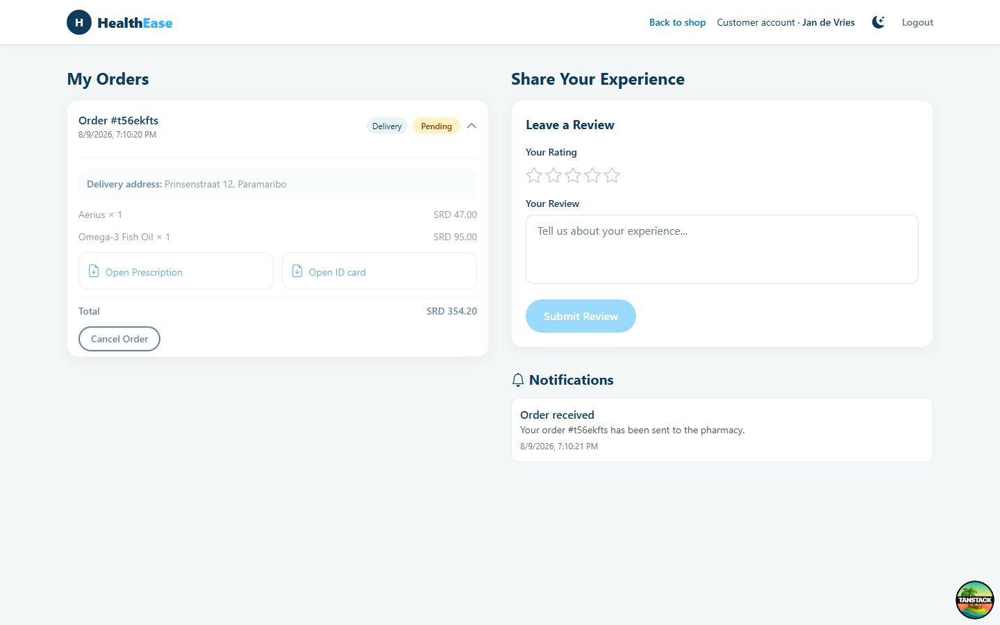

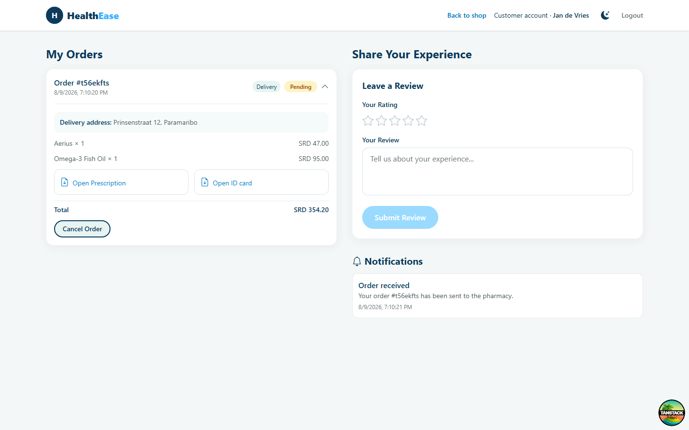

### 5.2 Deel je ervaring

Naast "My Orders" staat het blok **"Share Your Experience"** met het formulier **"Leave a Review"**:

- **Your Rating** — klik op een van de vijf sterren.
- **Your Review** — schrijf je ervaring in het tekstvak.

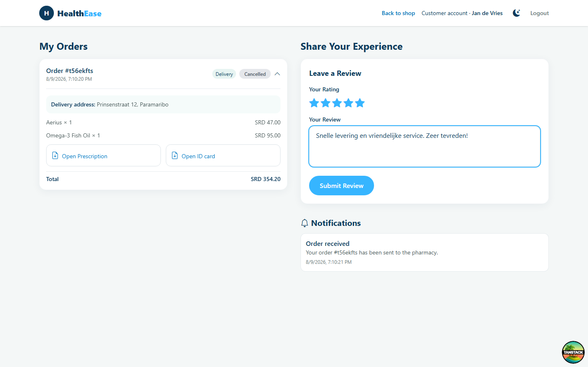

Klik op **Submit Review** om te versturen. Dit is een algemene ervaringsreview (niet gekoppeld aan één specifiek product of bestelling); je review verschijnt daarna in de sectie **"Reviews"** op de homepage (zie 2.3).

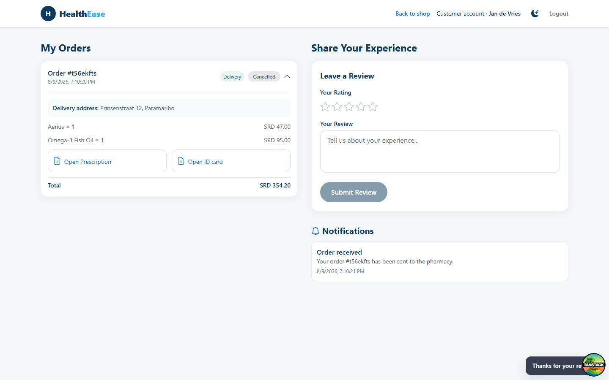

:::note
De losse pagina **/testimonials** bestaat nog wel, maar staat niet meer in de navigatiebalk en toont alleen vaste voorbeeldreviews — nieuw geplaatste reviews verschijnen daar niet.
:::

### 5.3 Meldingen (Notifications)

Onder "Share Your Experience" staat het blok **"Notifications"** (met een bel-icoon). Hier verschijnen meldingen over je bestellingen, bijvoorbeeld wanneer de apotheek de status van een bestelling bijwerkt. Elke melding toont een titel, een korte omschrijving en het tijdstip. Zijn er nog geen meldingen, dan zie je de tekst "Order updates will appear here."

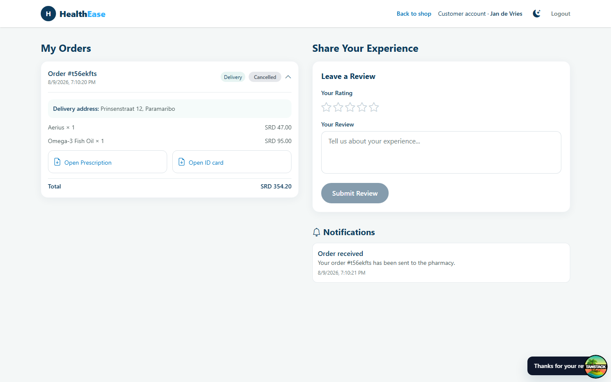

## 6. Contact opnemen

Ga naar **Contact** om een bericht te sturen. Kies eerst het type bericht via de knoppen **Consulting** of **Sponsoring**, vul dan **Name**, **Email**, optioneel **Location** en je **Message** in, en klik op **Send Message**.

Op dezelfde pagina staan ook het adres (Waterkant 1, Paramaribo, Suriname) en het algemene e-mailadres (hello@healthease.sr).

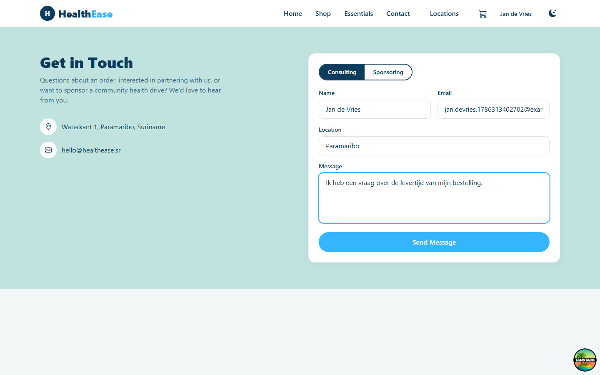

## 7. Algemene voorwaarden

De pagina **Terms & Conditions** (bereikbaar via de link bij het akkoordvakje in checkout, of via de footer) bestaat uit vijf onderdelen:

1. **Orders** — door te bestellen bevestig je dat alle opgegeven gegevens, inclusief het geüploade recept en identiteitsbewijs, correct zijn.
2. **Delivery** — bezorging is beschikbaar tot 15 km van de apotheek; de bezorgkosten worden op basis van afstand berekend en getoond vóór je afrekent; afhaalbestellingen moeten binnen het afgesproken tijdvak worden opgehaald.
3. **Privacy** — je recept en identiteitsbewijs worden alleen gebruikt om je bestelling te verifiëren en zijn alleen zichtbaar voor jou en de betreffende apotheek.
4. **Returns** — vanwege de aard van farmaceutische producten kunnen bestellingen na levering of afhalen niet worden geretourneerd, behalve bij een fout van HealthEase zelf.
5. **Contact** — voor vragen over deze voorwaarden verwijst de pagina naar de Contact-pagina.

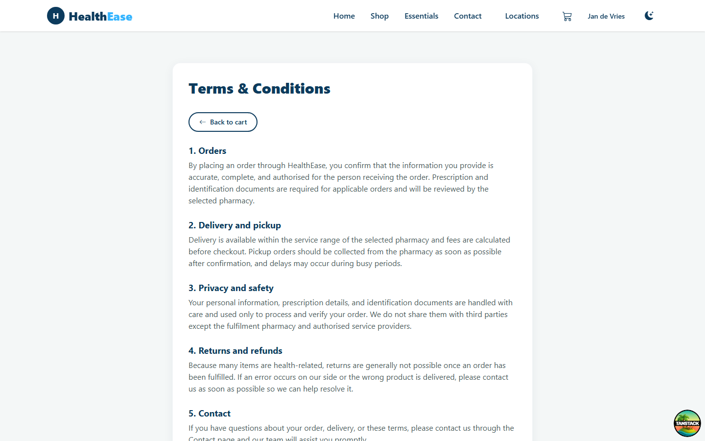

## Hulp nodig?

Kom je er niet uit, kijk dan op de **FAQ**-pagina in het hoofdmenu (vragen over voorraad checken, rechtstreeks bestellen, de dichtstbijzijnde apotheek vinden en wanneer een recept nodig is). Staat je vraag er niet bij, gebruik dan de knop **"Contact Us"** onderaan de FAQ, of ga naar [Contact opnemen](#6-contact-opnemen) hierboven.
